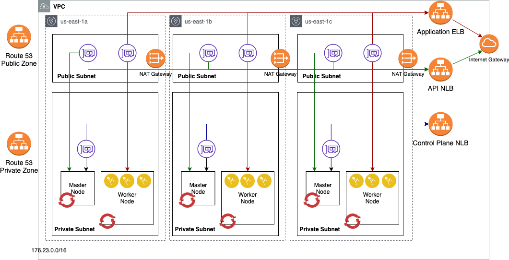

# Automated OpenShift v4 installation on AWS

This project automates the Red Hat OpenShift Container Platform 4.6 (for previous releases - checkout `pre46` branch) installation on Amazon AWS platform. It focuses on the OpenShift User-provided infrastructure installation (UPI) where implementers provide pre-existing infrastructure including VMs, networking, load balancers, DNS configuration etc.

* [Terraform Automation](#terraform-automation)
* [Infrastructure Architecture](#infrastructure-architecture)
* [Installation Procedure](#installation-procedure)
* [Airgapped installation](#airgapped-installation)
* [Removal procedure](#removal-procedure)
* [Advanced topics](#advanced-topics)

## Terraform Automation

This project uses mainly Terraform as infrastructure management and installation automation driver. All the user provisioned resource are created via the terraform scripts in this project.

### Prerequisites

1. To use Terraform automation, download the Terraform binaries [here](https://www.terraform.io/). The code here supports Terraform 0.15 or later.

   On MacOS, you can acquire it using [homebrew](brew.sh) using this command:

   ```bash
   brew install terraform
   ```

2. Install git

   ```bash
   sudo yum intall git-all
   git --version
   ```

4. Install wget command:

    - MacOS:
      ```
      brew install wget
      ```
    - Linux: (choose the command depending on your distribution)
      ```
      apt-get install wget
      yum install wget
      zypper install wget
      ```

6. Get the Terraform code

   ```bash
   git clone https://github.com/ibm-cloud-architecture/terraform-openshift4-aws.git
   ```

7. Prepare the DNS

   OpenShift requires a valid public Route53 hosted zone. (Even if you plan to use an airgapped environment)

8. Prepare AWS Account Access

   Please reference the [Required AWS Infrastructure components](https://docs.openshift.com/container-platform/4.6/installing/installing_aws/installing-aws-account.html) to setup your AWS account before installing OpenShift 4.

   We suggest to create an AWS IAM user dedicated for OpenShift installation with permissions documented above.
   On the bastion host, configure your AWS user credential as environment variables:

    ```bash
    export AWS_ACCESS_KEY_ID=RKXXXXXXXXXXXXXXX
    export AWS_SECRET_ACCESS_KEY=LXXXXXXXXXXXXXXXXXX/ng
    export AWS_DEFAULT_REGION=us-east-2
    ```

## Infrastructure Architecture

For detail on OpenShift UPI, please reference the following:

* [https://docs.openshift.com/container-platform/4.6/installing/installing_aws/installing-aws-customizations.html](https://docs.openshift.com/container-platform/4.6/installing/installing_aws/installing-aws-customizations.html)

The terraform code in this repository supports 3 installation modes:

- External facing cluster in a private network: 

- Internal cluster with internet access: 

- Airgapped cluster with no access: 

There are other installation modes that are possible with this terraform set, but we have not tested all the possible combinations, see [Advanced usage](#advanced-topics)

## Installation Procedure

This project installs the OpenShift 4 in several stages where each stage automates the provisioning of different components from infrastructure to OpenShift installation. The design is to provide the flexibility of different topology and infrastructure requirement.

1. The deployment assumes that you run the terraform deployment from a Linux based environment. This can be performed on an AWS-linux EC2 instance. The deployment machine has the following requirements:

    - git cli
    - terraform 0.15 or later
    - wget command
    - jq command

2. Deploy the OpenShift 4 cluster using the following modules in the folders:

 	- route53: generate a private hosted zone using route 53
	- install: Build the installation files, ignition configs and modify YAML files
  - vpc: Create the VPC, subnets, security groups and load balancers for the OpenShift cluster
	- iam: define AWS authorities for the masters and workers
	- bootstrap: main module to provision the bootstrap node and generates OpenShift installation files and resources
	- master: create master nodes manually (UPI)

	You can also provision all the components in a single terraform main module, to do that, you need to use a terraform.tfvars, that is copied from the terraform.tfvars.example file. The variables related to that are:

	Create a `terraform.tfvars` file with following content:

```
cluster_name = "ocp4"
base_domain = "example.com"
openshift_pull_secret = "./openshift_pull_secret.json"
openshift_version = "4.6.28"

aws_extra_tags = {
  "owner" = "admin"
  }
aws_region = "us-east-1"
aws_publish_strategy = "External"
```

|name | required  | description and value        |
|----------------|------------|--------------|
| `cluster_name` | yes  | The name of the OpenShift cluster you will install     |
| `base_domain`  | yes | The domain that has been created in Route53 public hosted zone |
| `openshift_pull_secret` | no | The value refers to a file name that contain downloaded pull secret from https://cloud.redhat.com/openshift/pull-secret; the default name is `openshift_pull_secret.json` |
| `openshift_version` | yes | The openshift version to be installed.  |
| `aws_region`   | yes  | AWS region that the VPC will be created in.  By default, uses `us-east-2`.  Note that for an HA installation, the AWS selected region should have at least 3 availability zones. |
| `aws_extra_tags`  | no  | AWS tag to identify a resource for example owner:myname     |
| `aws_azs` | no | list of availability zones to deploy VMs - default to the [`a`, `b`, `c`] |
| `openshift_byo_dns` | no | whether to ignore DNS resources (you still need a public zone defined) |
| `openshift_ssh_key` | no | whether to use a specific public key  |
| `openshift_additional_trust_bundle` | no | additional trust bundle for accessing resources - ie proxy or repo | 
| `aws_publish_strategy` | no | Whether to publish the API endpoint externally - Default: "External" |
| `airgapped` | no | A map with enabled (true/false) and repository name - This must be used with `aws_publish_strategy` of `Internal` |
| `proxy_config` | no | To be implemented  |
| `use_ipv4` | no | To be implemented  |
| `use_ipv6` | no | To be implemented  |


See [Terraform documentation](https://www.terraform.io/intro/getting-started/variables.html) for the format of this file.

### Deploying the cluster

Initialize the Terraform:

```bash
terraform init
```

Run the terraform provisioning:

```bash
terraform plan
terraform apply
```

### Removing bootstrap node
 
Once the cluster is installed, the bootstrap node is no longer used at all. One of the indication that the bootstrap has been completed is that the API load balancer target group shows that the bootstrap address is `unhealthy`. 

```
terraform destroy -target=module.bootstrap.aws_instance.bootstrap
```


## Airgapped Installation

For performing a completely airgapped cluster, there are two capabilities that would not be available from the cluster's automation capabilities, the IAM and Route53 management access. The airgapped solution can address this by pre-creating the roles and secret that are needed for OpenShift to complete its functions, but the DNS update on Route53 must be performed manually after the installation.

Setting up the mirror repository using AWS ECR:

1. Create the repository

    ```
    aws ecr create-repository --repository-name ocp435
    ```

2. Prepare your credential to access the ECR repository (ie the credential only valid for 12 hrs)

    ```
    aws ecr get-login
    ```

    Extract the password token (`-p` argument) and create a Base64 string:

    ```
    echo "AWS:<token>" | base64 -w0
    ```

    Put that into your pull secret:

    ```
    {"353456611220.dkr.ecr.us-east-1.amazonaws.com":{"auth":"<base64string>","email":"abc@example.com"}}
    ```

3. Mirror quay.io and other OpenShift source into your repository

    ```
    export OCP_RELEASE="4.6.28-x86_64"
    export LOCAL_REGISTRY='1234567812345678.dkr.ecr.us-east-1.amazonaws.com'
    export LOCAL_REPOSITORY='ocp46'
    export PRODUCT_REPO='openshift-release-dev'
    export LOCAL_SECRET_JSON='/home/ec2-user/openshift_pull_secret.json'
    export RELEASE_NAME="ocp-release"

    oc adm -a ${LOCAL_SECRET_JSON} release mirror --max-per-registry=1 \
       --from=quay.io/${PRODUCT_REPO}/${RELEASE_NAME}:${OCP_RELEASE} \
       --to=${LOCAL_REGISTRY}/${LOCAL_REPOSITORY} \
       --to-release-image=${LOCAL_REGISTRY}/${LOCAL_REPOSITORY}:${OCP_RELEASE}
    ```

4. Provide the certificate(s) for the registry in a file and refers that from the vars to be included in the `install-config.yaml`.

Once the mirror registry is created - use the terraform.tfvars similar to below:

```
cluster_name = "ocp4"
base_domain = "example.com"
openshift_pull_secret = "./openshift_pull_secret.json"
openshift_installer_url = "https://mirror.openshift.com/pub/openshift-v4/clients/ocp/4.6.28"

aws_access_key_id = "AAAA"
aws_secret_access_key = "AbcDefGhiJkl"
aws_ami = "ami-06f85a7940faa3217"
aws_extra_tags = {
  "owner" = "admin"
  }
aws_azs = [
  "us-east-1a",
  "us-east-1b",
  "us-east-1c"
  ]
aws_region = "us-east-1"
aws_publish_strategy = "Internal"
airgapped = {
  enabled = true
  repository = "1234567812345678.dkr.ecr.us-east-1.amazonaws.com/ocp435"
  cabundle = "./cabundle"
}
```

**Note**: To use `airgapped.enabled` of `true` must be done with `aws_publish_strategy` of `Internal` otherwise the deployment will fail. Also ECR does not allow for unauthenticated image pulls, additional IAM policies must be defined and attached to the nodes to be able to pull from ECR.

Create your cluster and then associate the private Hosted Zone Record in Route53 with the loadbalancer for the `*.apps.<cluster>.<domain>`.  

## Removal procedure

To delete the cluster - `terraform destroy` can be implemented.
The following items are not deleted (and may stop destroy from being successful):
- EBS volumes from the gp2 storage classes
- Public zone DNS updates
- Custom compute nodes that are not the initial worker nodes

## Advanced topics

Additional configurations and customization of the implementation can be performed by changing some of the default variables.
You can check the variable contents in the following terraform files:

- variable-aws.tf: AWS related customization, such as machine sizes and network changes
- config.tf: common installation variables for installation (not cloud platform specific)

**Note**: Not all possible combinations of options has been tested - use them at your own risk. 
