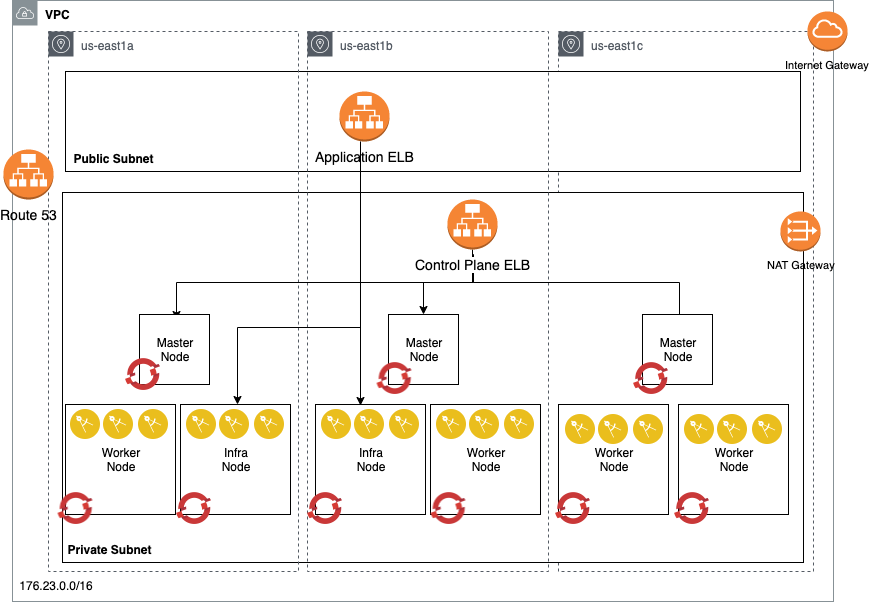

# Automated OpenShift v4 installation on AWS

This project automates the Red Hat Openshift Container Platform 4.2 installation on Amazon AWS platform. It focuses on the Openshift User-provided infrastructure installation (UPI) where end users provide pre-existing infrastructure including VMs, networking, load balancers, DNS configuration etc.

* [Infrastructure Architecture](#infrastructure-architecture)
* [Terraform Automation](#terraform-automation)
* [Installation Procedure](#installation-procedure)
* [Cluster access](#cluster-access)
* [AWS Cloud Provider](#aws-cloud-provider)


## Infrastructure Architecture

For detail on OpenShift UPI, please reference the following:


* [https://docs.openshift.com/container-platform/4.1/installing/installing_aws_user_infra/installing-aws-user-infra.html](https://docs.openshift.com/container-platform/4.1/installing/installing_aws_user_infra/installing-aws-user-infra.html)
* [https://github.com/openshift/installer/blob/master/docs/user/aws/install_upi.md](https://github.com/openshift/installer/blob/master/docs/user/aws/install_upi.md)


The following diagram outlines the infrastructure architecture.


## Terraform Automation

This project uses mainly Terraform as infrastructure management and installation automation driver. All the user provisioned resource are created via the terraform scripts in this project.

### Prerequisites

1. To use Terraform automation, download the Terraform binaries [here](https://www.terraform.io/). The code here supports Terraform 0.12 - 0.12.13; there are warning messages to run this on 0.12.14 and later.

   On MacOS, you can acquire it using [homebrew](brew.sh) using this command:

   ```bash
   brew install terraform
   ```

2. Install git

   ```bash
   sudo yum intall git-all
   git --version
   ```

3. Install OpenShift command line `oc` cli:

   ```bash
   wget https://mirror.openshift.com/pub/openshift-v4/clients/ocp/latest/openshift-client-linux-4.x.xx.tar.gz
   tar -xvf openshift-client-linux-4.x.xx.tar.gz
   chmod u+x oc kubectl
   sudo mv oc /usr/local/bin
   sudo mv kubectl /usr/local/bin
   oc version
   ```

4. Get the Terraform code

   ```bash
   git clone https://github.com/ibm-cloud-architecture/terraform-openshift4-aws.git
   ```

5. Prepare the DNS

   OpenShift requires a valid DNS domain, you can get one from AWS Route53 or using existing domain and registrar. The DNS must be registered as a Public Hosted Zone in Route53.


6. Prepare AWS Account Access

   Please reference the [Required AWS Infrastructure components](https://docs.openshift.com/container-platform/4.1/installing/installing_aws_user_infra/installing-aws-user-infra.html#installation-aws-user-infra-requirements_installing-aws-user-infra) to setup your AWS account before installing OpenShift 4.

   We suggest to create an AWS IAM user dedicated for OpenShift installation with permissions documented above.
   On the bastion host, configure your AWS user credential as environment variables:

    ```bash
    export AWS_ACCESS_KEY_ID=RKXXXXXXXXXXXXXXX
    export AWS_SECRET_ACCESS_KEY=LXXXXXXXXXXXXXXXXXX/ng
    export AWS_DEFAULT_REGION=us-east-2

    aws s3 ls
   ```

## Installation Procedure

This project installs the OpenShift 4 in several stages where each stage automates the provisioning of different components from infrastructure to OpenShift installation. The design is to provide the flexibility of different topology and infrastructure requirement.

1. The deployment assumes that you run the terraform deployment from a Linux based environment. This can be performed on an AWS-linux EC2 instance. The deployment machine has the following requirements:

    - git cli
    - terraform 0.12 or later
    - wget command

2. Deploy the OpenShift 4 cluster using the following modules in the folders:

 	- route53: generate a private hosted zone using route 53
  - vpc: Create the VPC, subnets, security groups and load balancers for the OpenShift cluster
	- install: Build the installation files, ignition configs and modify YAML files
	- iam: define AWS authorities for the masters and workers
	- bootstrap: main module to provision the bootstrap node and generates OpenShift installation files and resources
	- master: create master nodes manually (UPI)

	You can also provision all the components in a single terraform main module, to do that, you need to use a terraform.tfvars, that is copied from the terraform.tfvars.example file. The variables related to that are:

	Create a `terraform.tfvars` file with following content:

```
cluster_id = "ocp4-9n2nn"
clustername = "ocp4"
base_domain = "example.com"
openshift_pull_secret = "./openshift_pull_secret.json"
openshift_installer_url = "https://mirror.openshift.com/pub/openshift-v4/clients/ocp/latest"

aws_access_key_id = "AAAA"
aws_secret_access_key = "AbcDefGhiJkl"
aws_ami = "ami-06f85a7940faa3217"
aws_extra_tags = {
  "kubernetes.io/cluster/ocp4-9n2nn" = "owned",
  "owner" = "admin"
  }
aws_azs = [
  "us-east-1a",
  "us-east-1b",
  "us-east-1c"
  ]
aws_region = "us-east-1"
aws_publish_strategy = "External"
```

|name | required                        | description and value        |
|----------------|------------|--------------|
| `cluster_id` | yes | This id will be prefixed to all the AWS infrastructure resources provisioned with the script - typically using the clustername as its prefix.  |
| `clustername`     | yes          | The name of the OpenShift cluster you will install     |
| `base_domain` | yes | The domain that has been created in Route53 public hosted zone |
| `openshift_pull_secret` | no | The value refers to a file name that contain downloaded pull secret from https://cloud.redhat.com/openshift/install; the default name is `openshift_pull_secret.json` |
| `openshift_installer_url` | no | The URL to the download site for Red Hat OpenShift installation and client codes.  |
| `aws_region`   | yes         | AWS region that the VPC will be created in.  By default, uses `us-east-2`.  Note that for an HA installation, the AWS selected region should have at least 3 availability zones. |
| `aws_extra_tags`     | no          | AWS tag to identify a resource for example owner:myname     |
| `aws_ami` | yes | Red Hat CoreOS ami for your region (see [here](https://docs.openshift.com/container-platform/4.2/installing/installing_aws_user_infra/installing-aws-user-infra.html#installation-aws-user-infra-rhcos-ami_installing-aws-user-infra)). Other platforms images information can be found [here](https://github.com/openshift/installer/blob/master/data/data/rhcos.json) |
| `aws_secret_access_key` | yes | adding aws_secret_access_key to the cluster |
| `aws_access_key_id` | yes | adding aws_access_key_id to the cluster |
| `aws_azs` | yes | list of availability zones to deploy VMs |
| `aws_publish_strategy` | no | Whether to publish the API endpoint externally - Default: "External" |


See [Terraform documentation](https://www.terraform.io/intro/getting-started/variables.html) for the format of this file.

Initialize the Terraform:

```bash
terraform init
```

Run the terraform provisioning:

```bash
terraform plan
terraform apply
```

## Removal Procedure

For the removal of the cluster, there are several considerations for removing AWS resources that are created by the cluster directly, but not using Terraform. These resources are unknown to terraform and must be deleted manually from AWS console.
Some of these resources also hamper the ability to run `terraform destroy` as it becomes a dependent resource that prevent its parent resource to be deleted.

The cluster created resources are:

- Resources that prevents `terraform destroy` to be completed:
  - Worker EC2 instances
  - Application Load Balancer (classic load balancer) for the `*.apps.<cluster>.<domain>`
  - Security Group for the application load balancer
- Other resources that are not deleted:
  - S3 resource for image-registry
  - IAM users for the cluster
  - Public Route53 Record set associated with the application load balancer

## Airgapped Installation

For performing a completely airgapped cluster, there are two capabilities that would not be available from the cluster's automation capabilities, the IAM and Route53 management access. The airgapped solution can address this by pre-creating the roles and secret that are needed for OpenShift to complete its functions, but the DNS update on Route53 must be performed manually after the installation.

Setting up the mirror repository using AWS ECR:

1. Create the repository

  ```
  aws ecr create-repository --repository-name ocp435
  ```

2. Prepare your credential to access the ECR repository (ie the credential only valid for 12 hrs)

  ```
  aws ecr get-login
  ```

  and extract the password (`-p` argument) and create a Base64 string:

  ```
  echo "AWS:<token>" | base64 -w0
  ```

  and put that into your pull secret:

  ```
  {"353456611220.dkr.ecr.us-east-1.amazonaws.com":{"auth":"<base64string>","email":"abc@example.com"}}
  ```

3. Mirror quay.io and other OpenShift source into your repository

  ```
  export OCP_RELEASE="4.3.5-x86_64"
  export LOCAL_REGISTRY='1234567812345678.dkr.ecr.us-east-1.amazonaws.com'
  export LOCAL_REPOSITORY='ocp435'
  export PRODUCT_REPO='openshift-release-dev'
  export LOCAL_SECRET_JSON='/home/ec2-user/openshift_pull_secret.json'
  export RELEASE_NAME="ocp-release"

  oc adm -a ${LOCAL_SECRET_JSON} release mirror --max-per-registry=1 \
     --from=quay.io/${PRODUCT_REPO}/${RELEASE_NAME}:${OCP_RELEASE} \
     --to=${LOCAL_REGISTRY}/${LOCAL_REPOSITORY} \
     --to-release-image=${LOCAL_REGISTRY}/${LOCAL_REPOSITORY}:${OCP_RELEASE}
  ```

Once the mirror registry is created - use the terraform.tfvars similar to below:

```
cluster_id = "ocp4-9n2nn"
clustername = "ocp4"
base_domain = "example.com"
openshift_pull_secret = "./openshift_pull_secret.json"
openshift_installer_url = "https://mirror.openshift.com/pub/openshift-v4/clients/ocp/latest"

aws_access_key_id = "AAAA"
aws_secret_access_key = "AbcDefGhiJkl"
aws_ami = "ami-06f85a7940faa3217"
aws_extra_tags = {
  "kubernetes.io/cluster/ocp4-9n2nn" = "owned",
  "owner" = "admin"
  }
aws_azs = [
  "us-east-1a",
  "us-east-1b",
  "us-east-1c"
  ]
aws_region = "us-east-1"
aws_publish_strategy = "External"
airgapped = {
  enabled = true
  repository = "1234567812345678.dkr.ecr.us-east-1.amazonaws.com/ocp435"
}
```

Create your cluster and then associate the private Hosted Zone Record in Route53 with the loadbalancer for the `*.apps.<cluster>.<domain>`.  
